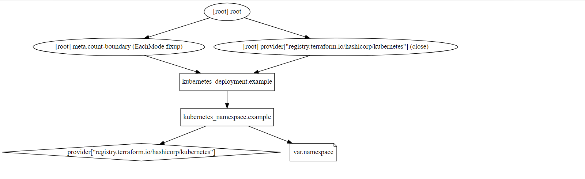

 # Terraform 基操
 
## Terraform 安装
[terraform](https://www.terraform.io/downloads.html) 官方下载或者去[github下载](https://github.com/hashicorp/terraform/releases)
1. https://www.terraform.io/downloads.html
``` 
wget https://releases.hashicorp.com/terraform/0.14.7/terraform_0.14.7_linux_amd64.zip
tar xf terraform_0.14.7_linux_amd64.zip
mv terraform /usr/bin/
```

### [编写注意](https://www.terraform.io/docs/language/files/index.html) 
- 文件扩展名.tf 或者.tf.json 
- 配置文件必须始终使用 UTF-8 编码，按照惯例通常使用 Unix 风格的行尾 （LF） 而不是 Windows 风格的行尾 （CRLF），但两者都被接受。
- 注释支持 `#` `//` `/* */`

### [Providers](https://www.terraform.io/docs/language/providers/index.html)
- terraform 根据提供的provider来识别resource type的定义 
- 只定义resource type不定义provider，terraform 无法识别resource type
- [providers](https://registry.terraform.io/browse/providers) 提供列表
- rsource type主要是providers 去提供

#### [怎么使用providers](https://www.terraform.io/docs/language/providers/index.html#how-to-use-providers)
- [providers](https://registry.terraform.io/browse/providers) 查找自己所需要的provider
- 安装terraform工具
- 按照提供的provider的doc 去编写tf文件
- 编辑好了 执行terraform init去下载对应provider提供的terraform插件

#####  [Example kubernetes](https://registry.terraform.io/providers/hashicorp/kubernetes/latest/docs)
- [providers](https://registry.terraform.io/browse/providers)仓库搜索kubernetes
- 点击进去,点击右上角Documentation，在点击Example Usage
- 复制example(./创建namespace/main.tf)  
- 素质三连（terraform init/terraform plan/terraform apply）
- namespace 创建好了

**main.tf**
```
provider "kubernetes" {
  config_path    = "~/.kube/config"
  #config_context = "my-context" 多环境使用
}

resource "kubernetes_namespace" "example" {
  metadata {
    name = "my-first-namespace"
  }
}
```
**修改name资源在执行terraform plan 可以清晰的看到资源变化**
 ```
 [root@k8s namespaces]# terraform plan 
kubernetes_namespace.example: Refreshing state... [id=my-first-namespace]

An execution plan has been generated and is shown below.
Resource actions are indicated with the following symbols:
-/+ destroy and then create replacement

Terraform will perform the following actions:

  # kubernetes_namespace.example must be replaced
-/+ resource "kubernetes_namespace" "example" {
      ~ id = "my-first-namespace" -> (known after apply)

      ~ metadata {
          - annotations      = {} -> null
          ~ generation       = 0 -> (known after apply)
          - labels           = {} -> null
          ~ name             = "my-first-namespace" -> "devops" # forces replacement
          ~ resource_version = "26492" -> (known after apply)
          + self_link        = (known after apply)
          ~ uid              = "497c0b1a-eec8-4bc5-867f-489c89028f40" -> (known after apply)
        }
    }

Plan: 1 to add, 0 to change, 1 to destroy.

------------------------------------------------------------------------

Note: You didn't specify an "-out" parameter to save this plan, so Terraform
can't guarantee that exactly these actions will be performed if
"terraform apply" is subsequently run.

 ```
**执行terraform apply -auto-approve**
**terraform会保存上一次执行的state，本次执行会删除变更的资源生成新的资源**
```
[root@k8s namespaces]# 
[root@k8s namespaces]# terraform apply -auto-approve 
kubernetes_namespace.example: Refreshing state... [id=my-first-namespace]
kubernetes_namespace.example: Destroying... [id=my-first-namespace]
kubernetes_namespace.example: Destruction complete after 6s
kubernetes_namespace.example: Creating...
kubernetes_namespace.example: Creation complete after 0s [id=devops]

Apply complete! Resources: 1 added, 0 changed, 1 destroyed.
[root@k8s namespaces]# 
```
## 在K8S生成deployment
- 编写main.tf 文件
```
 provider "kubernetes" {
  config_path    = "~/.kube/config"
  #config_context = "my-context" 多环境使用
}

resource "kubernetes_namespace" "example" {
  metadata {
    name = var.namespace
  }
}


resource "kubernetes_deployment" "example" {
  metadata {
    name = "terraform-example"
    namespace = var.namespace
    labels = {
      app = "nginx"
    }
  }

  spec {
    replicas = 3

    selector {
      match_labels = {
        app = "nginx"
      }
    }

    template {
      metadata {
        labels = {
          app = "nginx"
        }
      }

      spec {
        container {
          image = "nginx:1.7.8"
          name  = "example"

          resources {
            limits = {
              cpu    = "0.5"
              memory = "512Mi"
            }
            requests = {
              cpu    = "250m"
              memory = "50Mi"
            }
          }

          liveness_probe {
            http_get {
              path = "/"
              port = 80
            }

            initial_delay_seconds = 3
            period_seconds        = 3
          }
        }
      }
    }

  }

  // 定义依赖的资源
  depends_on = [
    kubernetes_namespace.example,
  ]
}
```
- 定义变量文件varables.tf(变量引用 var.variable)
```
variable "namespace" {
  description = "namespace"
  default = "default"
}

```
- 素质三连 init plan apply
```
[root@k8s deployment]# terraform apply   -auto-approve
kubernetes_namespace.example: Creating...
kubernetes_namespace.example: Creation complete after 0s [id=devops]
kubernetes_deployment.example: Creating...
kubernetes_deployment.example: Still creating... [10s elapsed]
kubernetes_deployment.example: Still creating... [20s elapsed]
kubernetes_deployment.example: Creation complete after 26s [id=devops/terraform-example]

Apply complete! Resources: 2 added, 0 changed, 0 destroyed.
[root@k8s deployment]# kubectl get deployments.apps -n devops 
NAME                READY   UP-TO-DATE   AVAILABLE   AGE
terraform-example   3/3     3            3           39s
[root@k8s deployment]# 

```
- 生成依赖图(terraform graph | dot -Tsvg > graph.svg) (安装yum install graphviz)
  

## [terraform cli](https://www.terraform.io/docs/cli/index.html) 常规命令
- **terraform init 初始化**
- **terraform plan  生成计划 对比上一次状态差异**
- **terraform apply 资源的新建和变更**
- **terraform destroy 资源的释放**
- **terraform taint 资源打污点先删除资源在创建资源**
- **terraform untaint 取消污点**
- **terraform validate 验证语法是否错误**
------------------------------------
**关注不迷路，不定期分享devops相关技术文章**


