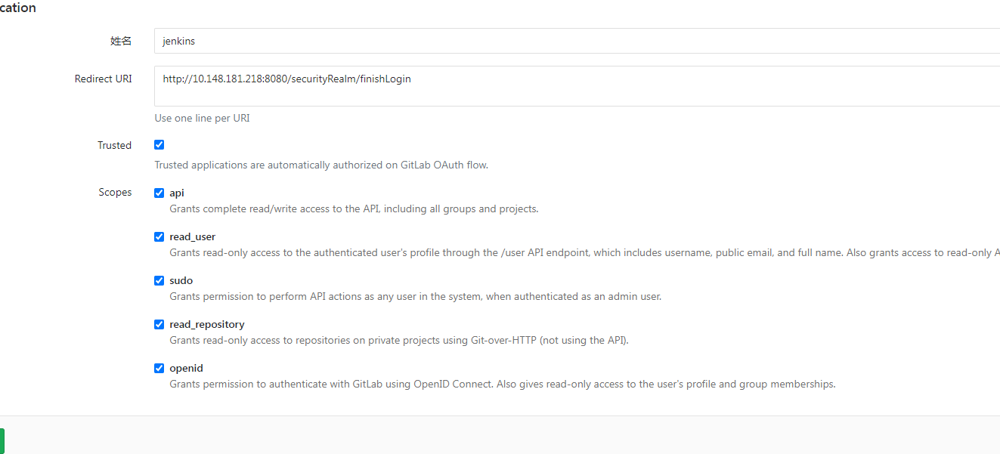
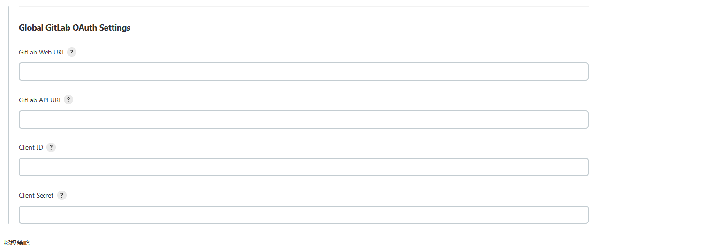

# jenkins  gitlab sso 账目登陆集成

1. 安装插件 `GitLab Authentication` 需要重启服务器
2. 登录gitlab 管理中心-->应用-->新建应用 (`Redirect URI` 填写`http://{jenkins地址}/securityRealm/finishLogin`)

3. 登录jenkins 系统管理-->全局安全配置-->gitlab验证(`GitLab API URI` `GitLab Web URI`为gitlab地址，id对应上图id，密码对应密码)

4. 安全策略(不然sso登录后没有权限)
