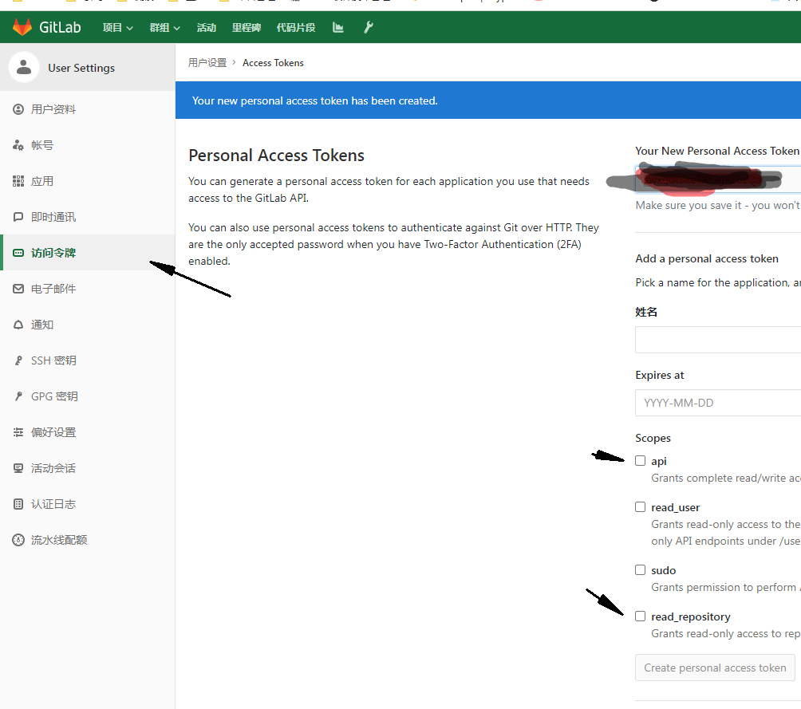
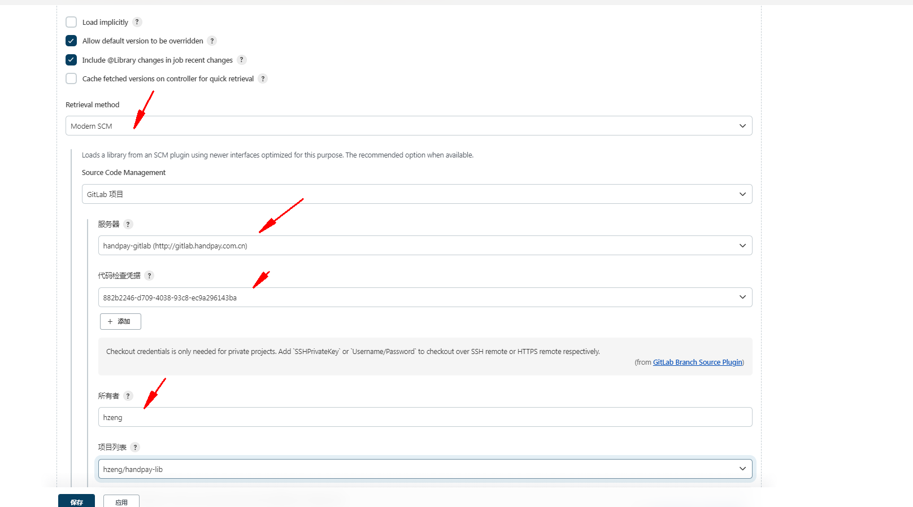

# jenkins gitlab 共享库


1. 系统配置-> 项目配置配置gitlab(个人token)
2. 

3. 系统配置-> 项目配置-->共享库

4. 调用共享库
````
#!groovy

@Library('github-lib@master') _
 
def tools = new org.devops.tools()
 

pipeline {
    agent any

    stages {
        stage('Hello') {
            steps {
                 script {
                      tools.PrintMes("执行打包","green")
                 }
            }
        }
    }
}


````
