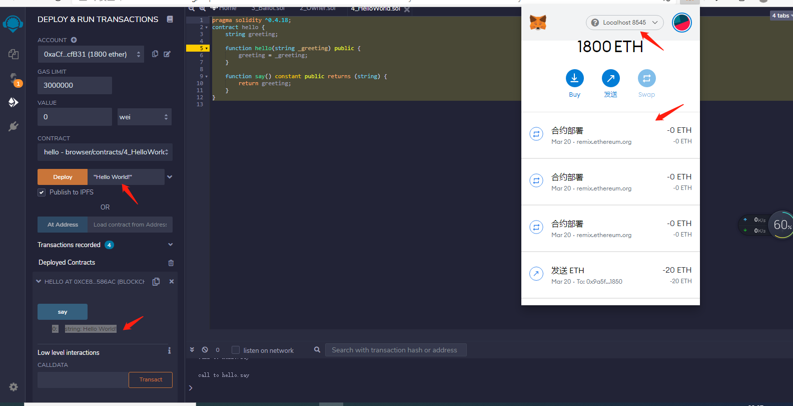

# 智能合约 HelloWorld

###IDE环境选其一
1. 在线环境 Remix -Solidity IDE(http://remix.ethereum.org/)
2. Atom/WebStorm/VSCode/Sublime
 
### 钱包MetaMask
1. https://metamask.io/

### 测试网络选其一
1. [Geth](https://geth.ethereum.org/docs)
2. Ganache 

## 启动私链
- godBlock.json 文件（
chainId 记住，在链接MetaMask,记得修改，否则交易操作GG）
``` 
{
  "config": {
    "chainId": 15, 
    "homesteadBlock": 0,
    "eip150Block": 0,
    "eip155Block": 0,
    "eip158Block": 0,
    "byzantiumBlock": 0,
    "constantinopleBlock": 0,
    "petersburgBlock": 0,
    "ethash": {}
  },
  "difficulty": "1",
  "gasLimit": "8000000",
  "alloc": {
    "7df9a875a174b3bc565e6424a0050ebc1b2d1d82": { "balance": "300000" },
    "f41c74c9ae680c1aa78f42e5647a62f353b7bdde": { "balance": "400000" }
  }
}

```

- 初始化区块链
``` 
C:\Users\Administrator>geth --datadir testNet init ./godBlock.json // 
INFO [03-20|20:39:34.100] Maximum peer count                       ETH=50 LES=0 total=50
INFO [03-20|20:39:34.135] Set global gas cap                       cap=25000000
INFO [03-20|20:39:34.138] Allocated cache and file handles         database=C:\Users\Administrator\testNet\geth\chaindata cache=16.00MiB handles=16
INFO [03-20|20:39:34.158] Writing custom genesis block
INFO [03-20|20:39:34.162] Persisted trie from memory database      nodes=3 size=397.00B time="515.2µs" gcnodes=0 gcsize=0.00B gctime=0s livenodes=1 livesize=0.00B
INFO [03-20|20:39:34.173] Successfully wrote genesis state         database=chaindata hash="c3638c…f97051"
INFO [03-20|20:39:34.176] Allocated cache and file handles         database=C:\Users\Administrator\testNet\geth\lightchaindata cache=16.00MiB handles=16
INFO [03-20|20:39:34.196] Writing custom genesis block
INFO [03-20|20:39:34.199] Persisted trie from memory database      nodes=3 size=397.00B time=1.0011ms  gcnodes=0 gcsize=0.00B gctime=0s livenodes=1 livesize=0.00B
INFO [03-20|20:39:34.206] Successfully wrote genesis state         database=lightchaindata hash="c3638c…f97051"

```

```
 geth --identity testNet --rpc --rpcport "8545" --datadir testNet   --nodiscover console --allow-insecure-unlock
```
- identity  自定义的节点名字
- rpc   允许 HTTP-RPC 访问
- rpcport   HTTP_RPC的访问端口，默认为8545 
- datadir  设置当前区块链网络数据存放的位置
- console  启动命令行模式，可以在Geth中执行命令
- nodiscover  私有链地址 
``` 
// 控制台
geth attach http://localhost:8545
```


### 钱包登入
1. MateMask登录后网络选择链接localhost:8545 geth启动的私链，记得修改链ID

### geth账户相关操作

- 创建账户
``` 
> personal.newAccount("zenghao") // 创建命令（密码为zenghao）
INFO [03-20|20:42:35.459] Your new key was generated               address=0xaCf31Bd39CE6e201c8598b2619bcd7a0dE5cfB31
WARN [03-20|20:42:35.463] Please backup your key file!             path=C:\Users\Administrator\testNet\keystore\UTC--2021-03-20T12-42-33.118060600Z--acf31bd39ce6e201c8598b2619bcd7a0de5cfb31
WARN [03-20|20:42:35.469] Please remember your password!
"0xacf31bd39ce6e201c8598b2619bcd7a0de5cfb31" // 钱包地址

```
- 查看账户
``` 
> eth.accounts // 查看账户
["0xacf31bd39ce6e201c8598b2619bcd7a0de5cfb31"]

```
- 查看账户余额
``` 
> eth.getBalance("0xacf31bd39ce6e201c8598b2619bcd7a0de5cfb31")
0
```
- 挖矿
``` 
// 矿工与钱包绑定
 > miner.setEtherbase("0xacf31bd39ce6e201c8598b2619bcd7a0de5cfb31")
true
> miner.start() // 启动挖矿
INFO [03-20|20:44:23.896] Updated mining threads                   threads=4
INFO [03-20|20:44:23.899] Transaction pool price threshold updated price=1000000000
INFO null[03-20|20:44:23.902] Commit new mining work
number=1 sealhash="a948d2…2d7040" uncles=0 txs> =0 gas=0 fees=0 elapsed="528.3µs"
INFO [03-20|20:44:25.511] Successfully sealed new block            number=1 sealhash="a948d2…2d7040" hash="f7fa67…cccfe7" elapsed=1.608s
INFO [03-20|20:44:25.520] 🔨 mined potential block                  number=1 hash="f7fa67…cccfe7"
INFO [03-20|20:44:25.511] Commit new mining work                   number=2 sealhash="752d81…2dad3b" uncles=0 txs=0 gas=0 fees=0 elapsed=0s
> miner.stop() // 停止挖矿

> eth.getBalance("0xacf31bd39ce6e201c8598b2619bcd7a0de5cfb31")//查询余额 感觉发财了
98000000000000000000
```
- 账户解锁
``` 
> personal.unlockAccount(eth.accounts[0],"zenghao",1000000)
INFO [03-20|21:07:43.838] Looking for peers                        peercount=0 tried=43 static=0
true
>

```

- 转账
``` 
var from = eth.accounts[0]
var to = eth.accounts[1]
var amount = 10
personal.unlockAccount(from,"zenghao",100000)   
eth.sendTransaction({
  from:from,
  to:to,
  value:web3.toWei(amount),
})

```

- 查看等待确认的交易
``` 
> txpool.status
{
  pending: 3,
  queued: 0
}

```

## 智能合约
``` 
pragma solidity ^0.4.18;
contract hello {
    string greeting;
    
    function hello(string _greeting) public {
        greeting = _greeting;
    }

    function say() constant public returns (string) {
        return greeting;
    }
}

```
### remix 
- 打开 http://remix.ethereum.org/
- 新建文件
- 编译
- 部署
  